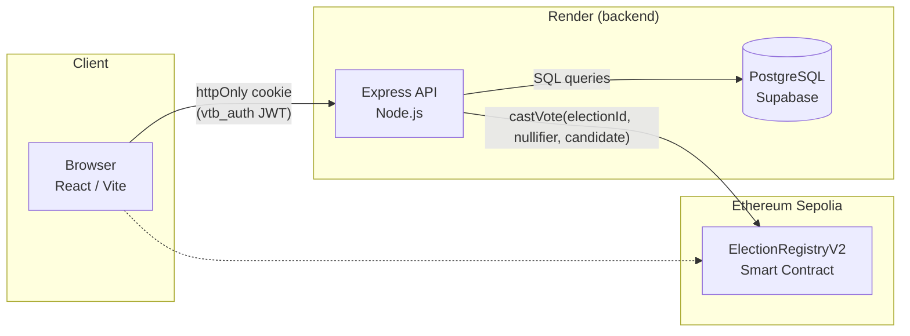

# VTB - Vote Through Blockchain

> Institutional voting with an immutable public record and a tally anyone can verify.

VTB is a hybrid Web2 + Web3 voting platform for universities and schools.
Administrators manage users and elections through a web panel. Students vote
through the browser — no wallet required.

Each vote generates a **nullifier** (HMAC of userId + electionId) that the
backend posts to a Solidity smart contract on Ethereum Sepolia as the relayer.
The blockchain stores `(nullifier, candidate)` — no name or email — so anyone can
recount the votes the contract accepted and the contract rejects a second vote
with the same nullifier. This is pseudonymity, **not** anonymity: the operator
can link a voter to a vote while it is being processed (see `SEGURIDAD.md`).

Demo accounts under `@vtb.demo` store a demonstration vote with no transaction
hash for quick testing — the seed only generates data for this domain (the
fictional "Meridian University"), so a live demo never shows placeholder
institutions. Real institutional deployments (a different domain per client)
vote through the configured Ethereum network and receive a real transaction hash.

## Architecture


```mermaid
flowchart LR
    subgraph Client
        B[Browser\nReact / Vite]
    end

    subgraph Render["Render (backend)"]
        E[Express API\nNode.js]
        DB[(PostgreSQL\nSupabase)]
    end

    subgraph Chain["Ethereum Sepolia"]
        SC[ElectionRegistryV2\nSmart Contract]
    end

    B -- "httpOnly cookie\n(vtb_auth JWT)" --> E
    E -- "SQL queries" --> DB
    E -- "castVote(electionId, nullifier, candidate)" --> SC
    B -.-> SC
```

**Auth flow** — three cookies set by the backend:

| Cookie | httpOnly | TTL | Purpose |
|---|---|---|---|
| `vtb_auth` | ✓ | 15 min | Access JWT — bearer of identity |
| `vtb_refresh` | ✓ | 7 days | Refresh token — rotates `vtb_auth` |
| `vtb_csrf` | ✗ | 15 min | CSRF token — JS reads it and sends as `X-CSRF-Token` header |

**Vote flow** — nullifier protects double-vote:
1. User picks a candidate and confirms → frontend sends `{ electionId, candidateId }`
2. Backend reads JWT from cookie → `userId`, and checks eligibility and that the election is registered on-chain
3. Backend computes `nullifier = HMAC(userId + electionId)` with server secret
4. Backend calls `contract.castVote(electionId, nullifier, candidatePosition)` — the candidate's position in the election (0..n-1), not its database id — and records the txHash
5. Blockchain rejects any second call with the same nullifier

```
Stack: React 19 · Vite 8 · Tailwind CSS 3 · framer-motion
       Express 5 · TypeScript · SQLite (dev/test) · PostgreSQL (prod)
       ethers.js 6 · Hardhat · Solidity 0.8 · Sepolia testnet
```

## Live Demo

| Service | URL |
|---|---|
| Frontend | https://vtb-frontend-three.vercel.app |
| Backend | https://vtb-backend-4emv.onrender.com |
| Sepolia contract (v2) | https://sepolia.etherscan.io/address/0x124759Cc8bb31AAD866930dCd3caE6f148e4F607 |

The v2 contract is deployed and its relayer is authorized, but no election has
been created in it yet: the elections currently running in production are still
on the previous contract. See `SEGURIDAD.md` and `docs/CAMBIOS_VERANO_2026.md`.

Render free-tier backends can sleep after inactivity. The first request after a
sleep may take 30-40 seconds.

## Demo Accounts

### Synthetic demo accounts

These accounts are local/demo only. Their votes are stored without a transaction
hash (`vote_source = 'demo'`) and do not create an Etherscan transaction. The
shortcut only exists where `DEMO_LOGIN_ENABLED=true`. In the UI, `@vtb.demo` renders as the
fictional institution **Meridian University** — the emails/passwords below
are unchanged, only the display name and election data shown on screen use
that persona (see `seedDatabase.ts`).

| Account | Password | Role | Shown as |
|---|---|---|---|
| `student@vtb.demo` | `SEED_DEMO_STUDENT_PASSWORD` (default `demo123`) | Voter | Alex Ferrer |
| `student2@vtb.demo` | `SEED_DEMO_STUDENT_PASSWORD` (default `demo123`) | Voter | Marina Costa |
| `admin@vtb.demo` | `SEED_DEMO_ADMIN_PASSWORD` — **required, no default** | Admin | Elena Ibarra |
| `superadmin@vtb.demo` | `SEED_DEMO_SUPERADMIN_PASSWORD` — **required, no default** | Super admin | Marta Reyes |
| `superadmin@vtb.system` | `SEED_SUPERADMIN_PASSWORD` — **required, no default** | Super admin (platform) | Super Admin |

> **Privileged account passwords are never hardcoded and never published here.**
> `npm run seed` aborts, naming the missing variable, if any of the three
> `SEED_*` variables above is absent or shorter than 12 characters. Generate
> each one with:
>
> ```bash
> node -e "console.log(require('crypto').randomBytes(18).toString('base64url'))"
> ```
>
> Only the two student demo accounts keep a default, because they hold no
> privileges on a fictional domain. If you are deploying anywhere reachable
> from the internet, set `SEED_DEMO_STUDENT_PASSWORD` too.

### Real institutional accounts

The seed script (`seedDatabase.ts`) no longer creates accounts for any real
institution — only `vtb.demo` (the fictional Meridian University) and
`vtb.system` (the platform superadmin). A real institutional deployment gets
its own domain and admin-created accounts, added through the admin panel or
CSV import, not through this seed. Those accounts vote through the configured
Ethereum network and receive a real transaction hash instead of a synthetic
one.

> If you're maintaining an older deployment that still has accounts under a
> different domain from before this change, they were not deleted — the seed
> only stopped *creating new ones*. See the "Demo data" note in `seedDatabase.ts`
> for the exact idempotency guarantees.

## Quick start

```bash
git clone https://github.com/javier-picazo-trigueros/VTB_DEMO.git
cd VTB_DEMO
```

Then follow [`SETUP.md`](SETUP.md) (in Spanish): install, create `backend/.env`,
seed the local database and start both apps. Locally the backend uses SQLite, so no
blockchain, Supabase or email account is needed to try it with the demo accounts.

## Documentation

| Document | What it is |
|---|---|
| [`SETUP.md`](SETUP.md) | Get VTB running locally: install, environment variables, database |
| [`docs/DESARROLLO.md`](docs/DESARROLLO.md) | Git workflow, every npm script, testing votes on a local chain, troubleshooting |
| [`docs/DESPLIEGUE.md`](docs/DESPLIEGUE.md) | How production is deployed (Render, Vercel, Supabase, Sepolia) and how to verify it |
| [`ARCHITECTURE.md`](ARCHITECTURE.md) | System architecture, data model, vote flow |
| [`docs/API.md`](docs/API.md) | Endpoint reference |
| [`SEGURIDAD.md`](SEGURIDAD.md) | What the system guarantees and what it does not, written for an electoral committee |
| [`RECUENTO_INDEPENDIENTE.md`](RECUENTO_INDEPENDIENTE.md) | How a third party recounts an election from the chain alone |
| [`docs/CAMBIOS_VERANO_2026.md`](docs/CAMBIOS_VERANO_2026.md) | The move to the v2 contract and what it changed |
| [`docs/PROGRESO_PLAN.md`](docs/PROGRESO_PLAN.md) | Progress against the July 2026 work plan |
| [`CLAUDE.md`](CLAUDE.md) | Project rules: what must not break, how to write code, TDD |
| [`docs/historico/`](docs/historico/) | Past audits, kept for traceability of their findings |

## Known Technical Debt

### Rate limiter not tested in CI

The per-user vote rate limiter (`voteUserLimiter`, max 3 votes/min in production)
is bypassed in the test environment by setting `max` to 1 000 000 when
`NODE_ENV === 'test'`. This means the limiter itself is never exercised by the
automated suite. A future integration test should spin up the app with the real
limit and verify that the 4th vote attempt within a minute returns 429.

### Voter anonymity: not provided, pending Semaphore

The vote is **not anonymous**. The blockchain stores only the nullifier and the
candidate, with no name or email, but that is pseudonymity. Since
migration 016 the database keeps "this person has voted" (`election_participations`)
apart from "there is a vote for this candidate" (`nullifier_audit`, without
`user_id`), so once an election is closed no database row links a person to a
vote. The operator still knows the mapping at the moment the vote is processed
(see `SEGURIDAD.md` for what remains uncovered). A fully anonymous system would
use a zero-knowledge circuit (e.g. [Semaphore](https://semaphore.pse.dev/)) so
that even the backend cannot learn who voted for whom. Implementing Semaphore
requires replacing the relayer model with client-side ZK proof generation — a
significant architectural change planned for a future milestone.
